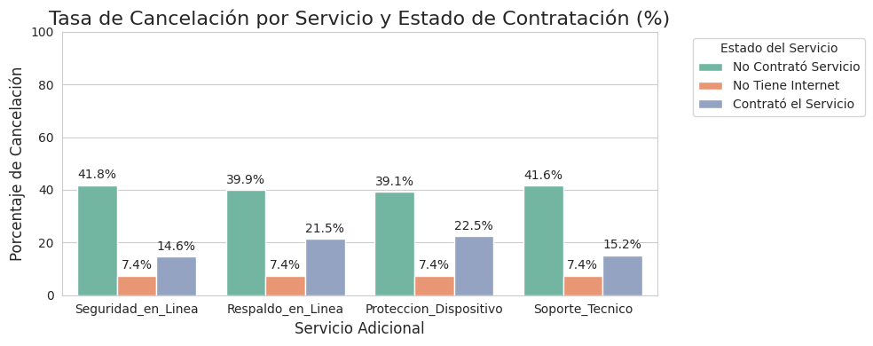

# 📊 TelecomX_LATAM - Análisis de Churn en Telecomunicaciones


Proyecto de análisis de datos para identificar patrones de cancelación (churn) en clientes de telecomunicaciones en Latinoamérica.

## 📌 Descripción

Ejercicio académico desarrollado para el programa **"Ciencia de Datos"** de [Allura Latam](https://www.alluralatam.com). El cuaderno analiza un dataset de clientes de telecomunicaciones para determinar:

🔹 Factores demográficos asociados al churn  
🔹 Relación entre tipo de contrato y cancelaciones  
🔹 Patrones por rango etario  
🔹 Impacto de los servicios contratados  

## 🛠 Tecnologías

| Librería       | Uso                              | Versión |
|----------------|----------------------------------|---------|
| `pandas`       | Manipulación de datos           | 1.5+    |
| `matplotlib`   | Visualizaciones básicas         | 3.6+    |
| `seaborn`      | Visualizaciones avanzadas       | 0.12+   |
| `requests`     | Importación de datos            | 1.23+   |

## 🚀 Cómo usar

1. **Abrir el cuaderno**:
   ```bash
   git clone https://github.com/MGastonK/Telecom_1/TelecomX_LATAM_Challenge_1.git
   cd TelecomX_LATAM_Challenge_1
2. **Ejecutar en Colab**:
https://colab.research.google.com/assets/colab-badge.svg



## ✍️ Autor
M. Gastón Kopelzon

Estudiante del programa "Ciencia de Datos" - Allura Latam
